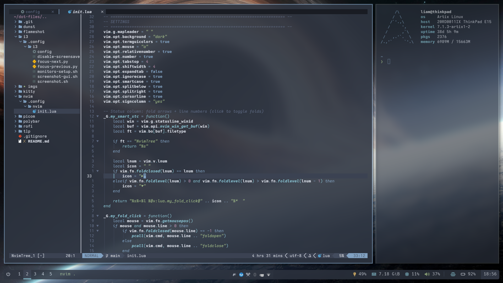

# Dot-files


My personal system configuration based on the i3 window manager and Polybar, structured for use with GNU Stow. The entire setup follows a consistent **Nord** color scheme.

## Screenshots

### Desktop View


### Neovim & Terminal



## Features

* **Window Manager:** i3wm (gaps, 3px borders, no titlebars)
* **Status Bar:** Polybar (Nord palette, custom scripts for battery, CPU, and brightness)
* **Terminal:** Kitty (90% opacity, Iosevka font)
* **Editor:** Neovim (Lazy.nvim, Nord theme, full LSP support, Copilot)
* **Launcher:** Rofi (Custom Nord theme, multiple modes)
* **Compositor:** Picom (Dual Kawase blur, rounded borders)
* **Notifications:** Dunst
* **Color Scheme:** System-wide Nord theme

## Requirements

Install the necessary packages depending on your distribution:

### Arch-based Linux
```bash
sudo pacman -S i3-wm polybar neovim rofi dunst picom stow kitty htop flameshot autorandr tlp
```

### Debian/Ubuntu
```bash
sudo apt update
sudo apt install i3 polybar neovim rofi dunst picom stow kitty htop flameshot autorandr tlp
```

### Fedora
```bash
sudo dnf install i3 polybar neovim rofi dunst picom stow kitty htop flameshot autorandr tlp
```

## Installation

This repository uses GNU Stow to manage symlinks.

1. Clone the repository:
```bash
git clone https://github.com/liamtoaldo/thinkpad-dot-files ~/dot-files
cd ~/dot-files
```

2. Create symbolic links for the user configuration files. Stow will link the files from each directory directly into the user's home directory (e.g., `~/.config/`).
```bash
stow i3 polybar nvim rofi dunst picom kitty htop flameshot autorandr
```

3. TLP configs go into `/etc`, so they must be linked as root:
```bash
sudo stow -t / tlp
```

## Structure

* `i3`: Main window manager config, autostart scripts, and keybindings.
* `polybar`: Bar configuration with Nord colors and custom shell scripts.
* `nvim`: Single `init.lua` setup using Lazy.nvim, Treesitter, Telescope, and Mason.
* `rofi`: Launcher configured with a custom 16-color Nord palette.
* `dunst`: Notification daemon styled with Nord urgency colors.
* `kitty`: Terminal emulator setup with split support and Iosevka Fixed Extended font.
* `picom`: Compositor configuration for blur and transparency.
* `tlp`: Power management tuning for Intel i7-10510U and AMD RX 640.

## Removal

To remove the symbolic links:
```bash
stow -D i3 polybar nvim rofi dunst picom kitty htop flameshot autorandr
sudo stow -t / -D tlp
```
